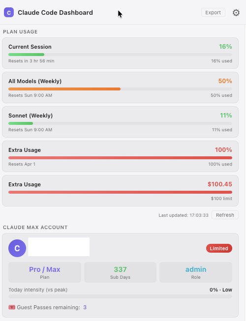
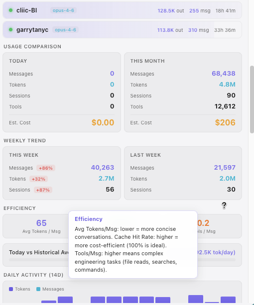

# Claude Code Dashboard

A macOS menu bar app for monitoring your Claude Code CLI sessions in real-time.


## Features

- **Live Session Monitoring** - Track active Claude Code CLI sessions with real-time status
- **Usage Statistics** - View today's and monthly token usage, message counts, and estimated costs
- **Cost Estimation** - Per-model pricing (Opus/Sonnet/Haiku) with cache hit rate tracking
- **Activity Heatmap** - Visualize your coding patterns by hour and day of week
- **Weekly Trends** - Compare this week's usage against last week
- **Multi-language** - Supports 22 languages including English, 繁體中文, 日本語, 한국어, and more
- **Plan Usage Scraping** - Fetch your Claude.ai subscription limits directly
- **Export Data** - Export your stats as JSON or CSV

## Screenshots

| Plan Usage & Account | Sessions & Statistics |
|:---:|:---:|
|  |  |

## Installation

### Download Release

Download the latest DMG from [GitHub Releases](https://github.com/immlyou/claude-code-dashboard/releases):

- **Apple Silicon (M1/M2/M3)**: `Claude-Code-Dashboard-x.x.x-arm64.dmg`
- **Intel Mac**: `Claude-Code-Dashboard-x.x.x-x64.dmg`

### From Source

```bash
# Clone the repository
git clone https://github.com/immlyou/claude-code-dashboard.git
cd claude-code-dashboard

# Install dependencies
npm install

# Run the app
npm start
```

### Build DMG

```bash
# Build for macOS (arm64)
npm run dist

# Or build specific format
npm run dist:dmg   # DMG installer
npm run dist:zip   # ZIP archive
```

## Usage

1. **Start the app** - Run `npm start` or launch the built app
2. **Look for the campfire icon** - Appears in your macOS menu bar (top right)
3. **Click to open dashboard** - View all your Claude Code statistics
4. **Right-click for menu** - Quick access to open dashboard or quit

### CLI Mode

You can also run the collector directly without the GUI:

```bash
npm run cli
```

## Data Sources

The dashboard reads data from your local Claude Code installation:

| Path | Description |
|------|-------------|
| `~/.claude/sessions/` | Active CLI session files |
| `~/.claude/projects/` | Project conversation logs (JSONL) |
| `~/.claude/stats-cache.json` | Aggregated statistics |
| `~/.claude.json` | Account info and settings |

## Configuration

Settings are stored in `~/.claude/dashboard-settings.json`:

```json
{
  "refreshInterval": 3000
}
```

### Refresh Interval

Configurable from 1 second to 1 minute via Settings panel.

## Supported Languages

| Language | Code |
|----------|------|
| English | en |
| 繁體中文 | zh-TW |
| 简体中文 | zh-CN |
| 日本語 | ja |
| 한국어 | ko |
| Deutsch | de |
| Français | fr |
| Español | es |
| Português | pt |
| Italiano | it |
| Русский | ru |
| العربية | ar |
| हिन्दी | hi |
| ไทย | th |
| Tiếng Việt | vi |
| Bahasa Indonesia | id |
| Türkçe | tr |
| Nederlands | nl |
| Svenska | sv |
| Polski | pl |
| Українська | uk |
| Bahasa Melayu | ms |

## Tech Stack

- **Electron** - Desktop app framework
- **menubar** - Menu bar integration
- **Pure JS/CSS** - No frontend framework dependencies

## Requirements

- macOS 11.0 (Big Sur) or later
- [Claude Code CLI](https://claude.ai/code) installed and configured
- Node.js 18+ (for building from source)

## License

MIT License - feel free to use and modify.

## Author

Made by [@immlyou](https://github.com/immlyou)

---

**Note**: This is an unofficial community tool. Not affiliated with Anthropic.
